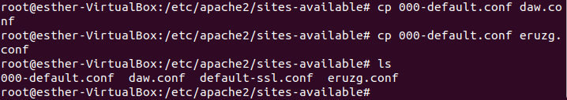
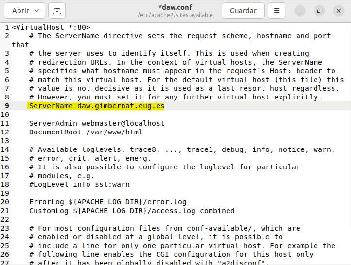
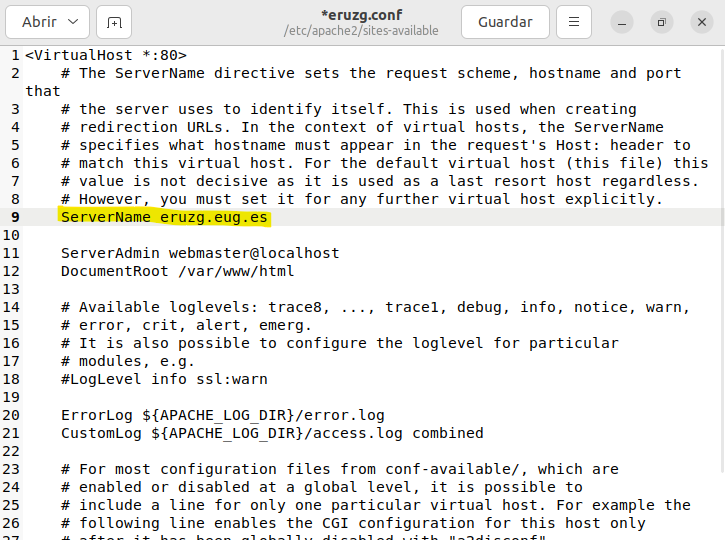
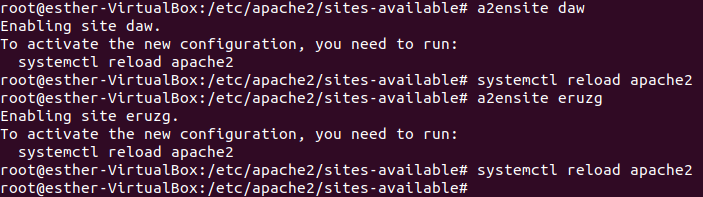
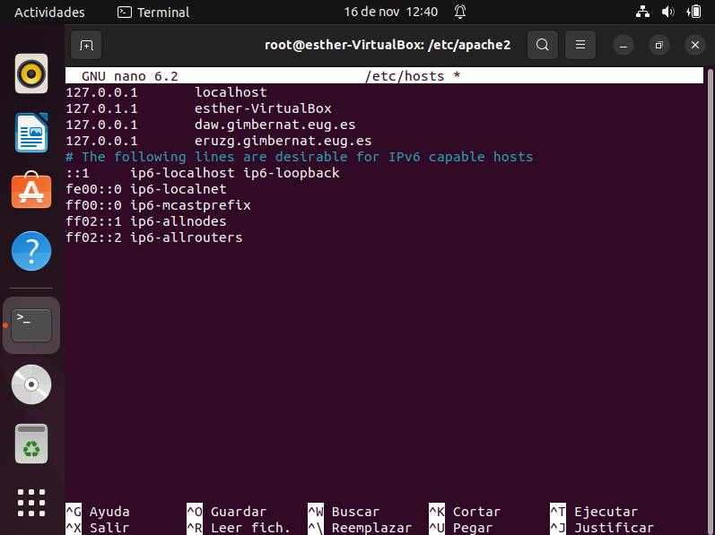

# DAW_-DAW_Ruz_Gonzalez_Esther4.md

## 1. Crea dos sitios web que compartirán IP y puerto, pero tendrán nombres DNS distintos para acceder a ellos. El nombre del primer dominio será daw.gimbernat.eug.es y el segundo tunombreyapellidos.gimbernat.eug.es, donde “tunombreyapellidos” contiene la inicial de tu nombre, el primer apellido, y la inicial de tu segundo apellido. De esta manera, si tu nombre es: Francisco Mesas Cervilla, el domino quedaría: fmesasc.gimbernat.eug.es.
## • En el primer caso, daw.gimbernat.eug.es tendrá su directorio base en /var/www/daw/ conteniendo una página llamada index.html que ponga el nombre de la clase como título con un archivo css para aplicarle estilos al título.
## • En el segundo caso, fmesasc.gimbernat.eug.es tendrá su directorio base en /var/www/fmesasc/ (el equivalente para vuestros nombres), conteniendo una página llamada index.html que contenga vuestro currículum aplicándole un estilo css para que se visualice correctamente.
## Para ello, tendrás que crear un archivo de configuración (copiado de 000-default.conf) para cada uno de los dominios. Recuerda que con a2ensite puedes crear los enlaces simbólicos necesarios para añadir esta configuración a la ejecución de apache.

### Para hacer dos sitios virtuales necesitamos dos archovos de configuración:
  

### Descomentamos la linea de ServerName y le ponemos el nombre de nuestro sitio web. Esto en los dos ficheros que he creado antes.
  
  

### Creamos un enlace simbolico dentro del directorio 
  

### Cambiamos el archovo ports.conf para que la ip que devuelva ssea la del localhost.
  
  
### Comprobamos que funciona:

